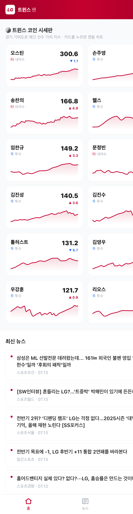
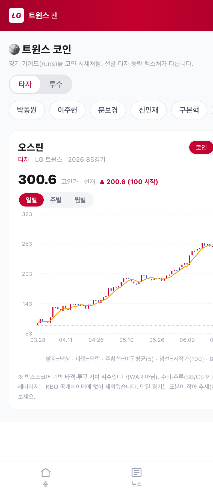
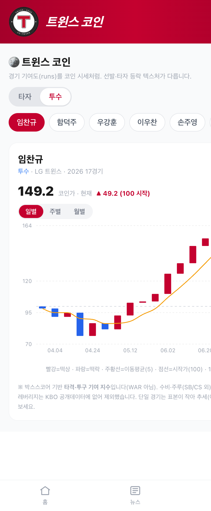

# 트윈스 코인 (Twins Coin)

> LG 트윈스 선수들의 가치를 **"코인 시세"처럼** 보여주는 웹사이트.
> 잘한 경기엔 코인이 오르고(떡상 🔴), 못한 경기엔 내린다(떡락 🔵). "창기 코인 떡상~"을 데이터로.

<p>
  
  
  
  
</p>

🔗 **Live demo:** https://lg-twins-app.vercel.app/
📄 **문서:** [기획](docs/PLANNING.md) · [코인 가격 모델](docs/VALUE_MODEL.md) · [디자인](docs/DESIGN.md) · [아키텍처](docs/ARCHITECTURE.md)

---

## 왜 만드나

네이버 스포츠는 모든 팀·모든 스탯을 나열하는 **종합 백과사전**이다. 하지만 "현재 타율 .298" 같은
*지금 값*만 보여줄 뿐, **선수가 팀에 만들어내는 가치가 어떻게 오르내리는지**는 못 보여준다.

정작 LG 팬들은 이미 그걸 **"창기 코인 떡상"**처럼 말한다 — 선수 퍼포먼스를 시세처럼 느끼는 것이다.
트윈스 코인은 그 감각을 **데이터로 구현**한다. 네이버와 포괄성으로 경쟁하지 않고, **한 팀 팬을 위한
가치 지수 + 코인 시세 경험**으로 차별화한다.

## 트윈스 코인이란

각 선수의 **경기별 기여(가치)를 누적한 지수 = 코인 가격**이다.

- 잘한 경기 → 코인 상승(빨강, 떡상) · 못한 경기 → 하락(파랑, 떡락).
- 캔들 하나 = 그 경기의 등락(open = 경기 전, close = 경기 후). 캔들 크기 = 그날 기여 크기.
- 이동평균선 = 가치 추세(진짜 신호). 일별·주별·월별 토글로 확대.

가치는 KBO 경기별 박스스코어로 **직접 계산**한다 — 타자는 wOBA 기반 타격 런, 투수는 평균 대비
막아낸 실점(+역할 보너스). 계산식은 [docs/VALUE_MODEL.md](docs/VALUE_MODEL.md).

> **투명성 고지:** 수비·주루·클러치(WPA)·대체선수 보정은 KBO 공개 데이터로 불가하여 제외했다.
> 즉 이 지수는 **박스스코어 기반 기여 지수이지 WAR가 아니다.** 단일 경기는 표본이 작아 노이즈이며,
> 누적 가격과 이동평균으로 해석해야 한다.

## 주요 기능

- **트윈스 코인 시세판 (홈)** — 타자·투수 코인 시세 랭킹을 한눈에(타/투 배지 + 미니 시세선).
- **선수 코인 (캔들 차트)** — 경기별 캔들 + 이동평균선, 코인/타율·OPS 토글, 일·주·월 전환.
- **우리 팀 뉴스 피드** — LG 뉴스만 모아 헤드라인·날짜로, 탭하면 원문으로.

## 스크린샷

| 홈 — 트윈스 코인 시세판 | 타자 코인 (캔들) | 투수 코인 (캔들) |
|:--:|:--:|:--:|
|  |  |  |

## 아키텍처 (요약)

KBO는 공개 API가 없어, **매일 도는 데이터 파이프라인**이 경기별 기록을 수집하고 **가치 모델로
코인 가격을 계산**해 JSON으로 떨군다. 웹사이트는 이를 읽어 캔들 차트로 그린다. GitHub Actions로
매일 자동 수집·계산한다. 상세: [ARCHITECTURE](docs/ARCHITECTURE.md).

```
[GitHub Actions 매일] → 스크래퍼 → 가치 모델(코인 가격 계산) → data/ JSON → [웹(React 캔들차트)]
```

## 기술 스택

| 구분 | 기술 |
|---|---|
| 데이터 파이프라인 | Python (requests, BeautifulSoup, pandas) |
| 가치 모델 | 자체 구현 (wOBA 선형가중치 · 실점 기반 · 누적 코인 가격) |
| 자동화 | GitHub Actions (cron) |
| 저장 | JSON |
| 프론트 | React + 캔들 차트 |

## 프로젝트 구조

```
├── pipeline/   # 수집 + 가치 계산 (roster·news·timeseries·pitcher·value_model·run_daily)
├── data/       # 산출 JSON: 선수별 코인 가격 시계열 (매일 자동 커밋)
├── web/        # React 웹사이트 (코인 시세판 · 캔들 차트)
├── docs/       # 기획 · 코인 가격 모델 · 디자인 · 아키텍처
├── spike/      # 데이터 실현가능성 검증(스파이크) 기록
└── .github/workflows/daily.yml
```

## 로드맵

- [x] **Phase 0** — 데이터 파이프라인 + 매일 자동 수집.
- [x] **Phase 1** — 뉴스 + 선수 스탯 시계열 웹사이트 배포.
- [x] **트윈스 코인** — 경기별 가치 지수(타자·투수) + 코인 가격 + 캔들 차트.
- [ ] **가치 모델 보정** — 리그 상수 자체 산출, 역할 보너스 튜닝.
- [ ] **로스터 이동 트래커** + LLM 사유 생성.
- [ ] (선택) 승부 예측 · 알림.

## 데이터 출처 · 고지

데이터는 KBO 공식·네이버 스포츠에서 수집한다. 뉴스는 **헤드라인과 원문 링크만** 다루고 본문은
저장하지 않는다. 코인 가격은 박스스코어 기반 **근사 지표**이며 공식 기록이 아니다. 개인·학습용 프로젝트다.
